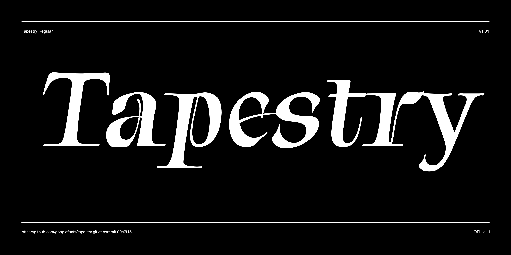

# Tapestry

Tapestry is a Roman calligraphic with slight rustic, country style. It's thick and thin strokes emulate the strokes of a flat nib pen. The capitals are classic Roman serifed forms while the extra thin movements in the lower case forms compliment the caps and allows Tapestry to dance on the page.



## Building the Fonts

The font is built using fontmake and gftools post processing script. Tools are all python based, so it must be previously installed.

To install all the Python tools into a virtualenv, do the following:

From terminal:

```

cd your/local/project/directory

#once in the project folder create a virtual environment. 
This step has to be done just once, the first time:

python3 -m venv venv

#activate the virtual environment

source venv/bin/activate

#install the required dependencies

pip install -r requirements.txt

```

Then run the this command:

```
cd sources
gftools builder config.yml
```
